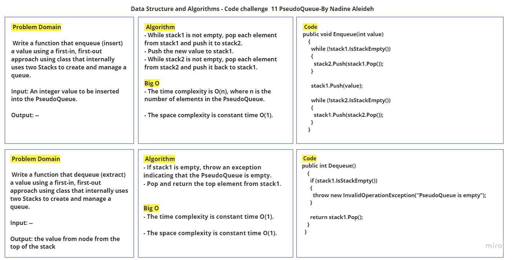

# Challenge Title: PseudoQueue Implementation using Two Stacks

## Description

This is a challenge to implement a PseudoQueue class that internally uses two Stacks to create and manage a queue. The PseudoQueue follows a first-in, first-out (FIFO) approach, where values are enqueued at the back and dequeued from the front.

## Method Inputs & Outputs , Approach & Efficiency

- **Enqueue(int value):** enqueue (insert) a value.

  - Input: An integer value to be inserted into the PseudoQueue.
  - Output: None.

  - Approach:
    - While stack1 is not empty, pop each element from stack1 and push it to stack2.
    - Push the new value to stack1.
    - While stack2 is not empty, pop each element from stack2 and push it back to stack1.

  - The time complexity is O(n), where n is the number of elements in the PseudoQueue.
  - The space complexity is constant time O(1).

- **Dequeue():** dequeue (extract) a value.

  - Input: None.
  - Output: the value from node from the top of the stack.

  - Approach:
    -  If stack1 is empty, throw an exception indicating that the PseudoQueue is empty.
    - Pop and return the top element from stack1.

  - The time complexity is O(1).
  - The space complexity is constant time O(1).


## Whiteboard Process




## Solution & Tests

- The code for the PseudoQueue implementation can be found in the [PseudoQueue.cs](../../DataStructures/PseudoQueue.cs) , [Node.cs](../../DataStructures/Node.cs) and [Stack.cs](../../DataStructures/Stack.cs) files.
- The code for the **Enqueue** and **Dequeue** functions can be found in the [PseudoQueue.cs](../../DataStructures/PseudoQueue.cs) file.
- To run the code, you can follow the example written in the Main method in the [Program.cs](../../DataStructures/Program.cs) file:

```

   PseudoQueue pseudoQueue = new PseudoQueue();
   pseudoQueue.Enqueue(10);
   pseudoQueue.Enqueue(15);
   pseudoQueue.Enqueue(20);

   Console.WriteLine(pseudoQueue.Dequeue()); // Output: 10
   Console.WriteLine(pseudoQueue.Dequeue()); // Output: 15

```
