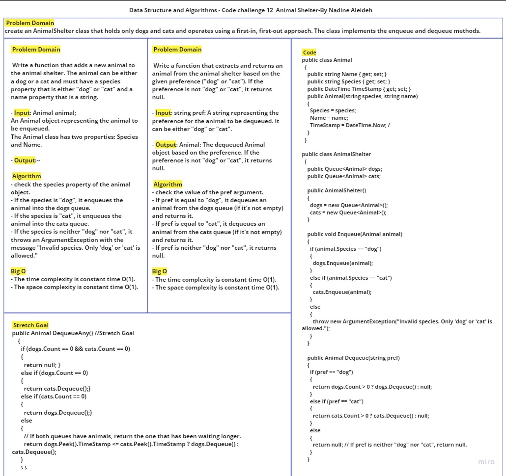
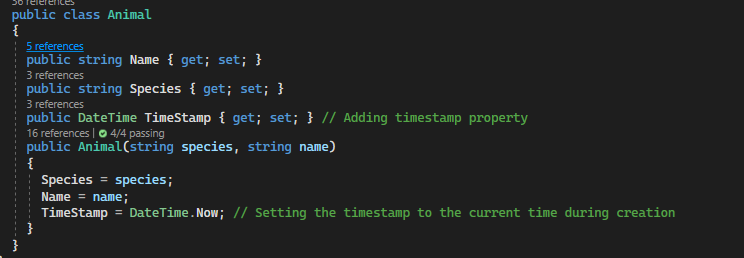
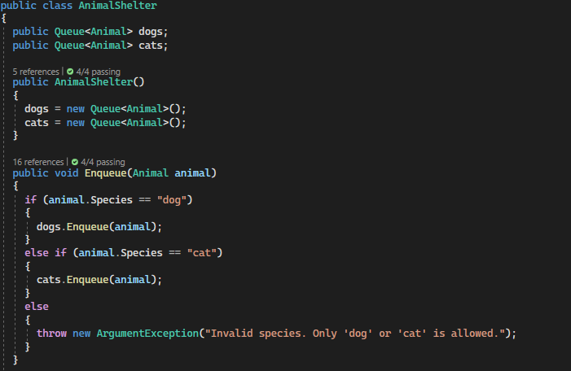
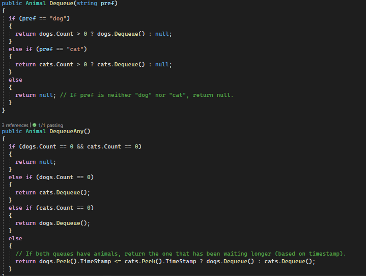

# AnimalShelter Implementation

This challenge involves creating an `AnimalShelter` class that holds only dogs and cats and operates using a first-in, first-out approach. The class implements the `enqueue` and `dequeue` methods.

## Whiteboard Process


## Approach & Efficiency
The `AnimalShelter` class uses two separate queues, one for dogs and one for cats, to implement the first-in, first-out approach.

**Enqueue Method**: adds a new animal to the animal shelter. The animal can be either a dog or a cat and must have a species property that is either "dog" or "cat" and a name property that is a string.
- Input: Animal animal; An Animal object representing the animal to be enqueued. The Animal class has two properties: Species and Name.
- Output:None
- Algorithm:
  - check the species property of the animal object.
  - If the species is "dog", it enqueues the animal into the dogs queue.
  - If the species is "cat", it enqueues the animal into the cats queue.
  - If the species is neither "dog" nor "cat", it throws an ArgumentException with the message "Invalid species. Only 'dog' or 'cat' is allowed."
- The time complexity is constant time O(1).
- The space complexity is constant time O(1).

**Dequeue Method**: extracts and returns an animal from the animal shelter based on the given preference ("dog" or "cat"). If the preference is not "dog" or "cat", it returns null.
- Input: string pref: A string representing the preference for the animal to be dequeued. It can be either "dog" or "cat".
- Output: Animal: The dequeued Animal object based on the preference. If the preference is not "dog" or "cat", it returns null.
- Algorithm:
  - check the value of the pref argument.
  - If pref is equal to "dog", it dequeues an animal from the dogs queue (if it's not empty) and returns it.
  - If pref is equal to "cat", it dequeues an animal from the cats queue (if it's not empty) and returns it.
  - If pref is neither "dog" nor "cat", it returns null.
- The time complexity is constant time O(1).
- The space complexity is constant time O(1).


## Solution





## How to use

To use the `AnimalShelter` implementation, follow these steps:

1. Instantiate an `AnimalShelter` object: `AnimalShelter shelter = new AnimalShelter();`
2. Enqueue dogs and cats using the `Enqueue` method: `shelter.Enqueue(new Animal("dog", "Buddy"));`
3. Dequeue specific preferences (dog or cat) using the `Dequeue` method: `Animal dog = shelter.Dequeue("dog");`
4. Dequeue any animal in the shelter using the `DequeueAny` method: `Animal anyAnimal = shelter.DequeueAny();`

Here's an example of how to use the `AnimalShelter`:

```
AnimalShelter shelter = new AnimalShelter();

shelter.Enqueue(new Animal("dog", "Buddy"));
shelter.Enqueue(new Animal("cat", "Whiskers"));
shelter.Enqueue(new Animal("dog", "Max"));
shelter.Enqueue(new Animal("cat", "Fluffy"));

Animal dog = shelter.Dequeue("dog");
Animal cat = shelter.Dequeue("cat");
Animal anyAnimal = shelter.DequeueAny();
```

This example demonstrates enqueuing dogs and cats into the `AnimalShelter` and dequeuing specific preferences as well as any animal from the shelter.

Feel free to check the [AnimalShelterTests.cs](../../DataStructuresTests/AnimalShelterTests.cs) file for the complete Tests details.


