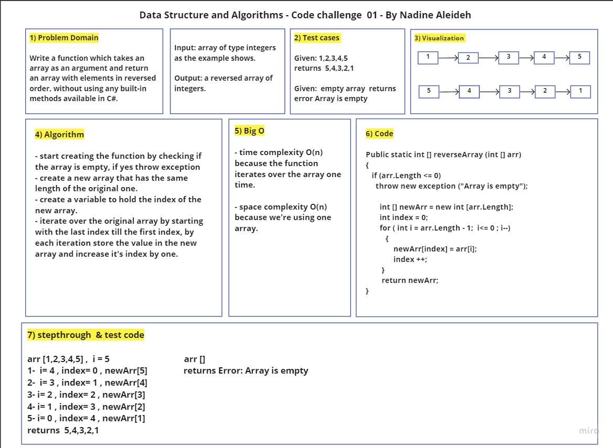

# Code challenge01: Reverse Array

Writing a function which takes an array as an argument and return an array with elements in reversed order, without using any built-in methods available in C#. 

## Whiteboard Process

## Approach & Efficiency

1. check if the array is empty, if yes throw exception
2. create a new array that has the same length of the original one.
3. create a variable to hold the index of the new array.
4. iterate over the original array by starting with the last index till the first index, by each iteration store the value in the new array and increase it's index by one. 

- time complexity O(n) because the function iterates over the array one time.

- space complexity O(n) because we're using one array.

