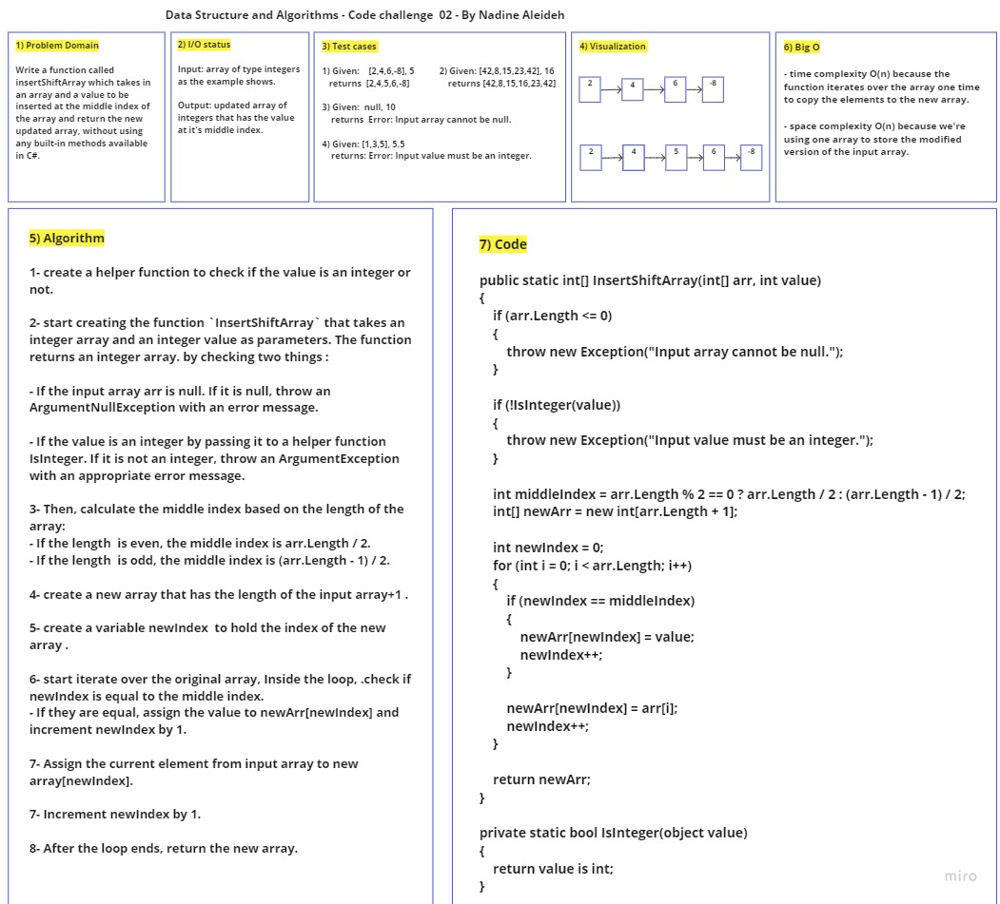

# Code challenge02: Insert Shift Array

Writing a function called insertShiftArray which takes in an array and a value to be inserted at the middle index of the array and return the new updated array, without using any built-in methods available in C#. this

## Whiteboard Process

## Approach & Efficiency

1. Check if the input array is null and throw an exception if it is.

2. heck if the value is an integer and throw an exception if it is not.

3. Calculate the middle index based on the length of the array, considering both odd and even cases.
Create a new array with a length of the original array plus one.

4. Iterate over the original array and copy the elements to the new array, inserting the value at the middle index.

5. Return the new array.

- time complexity O(n) because the function iterates over the array one time to copy the elements to the new array.

- space complexity O(n) because we're using one array to store the modified version of the input array.
