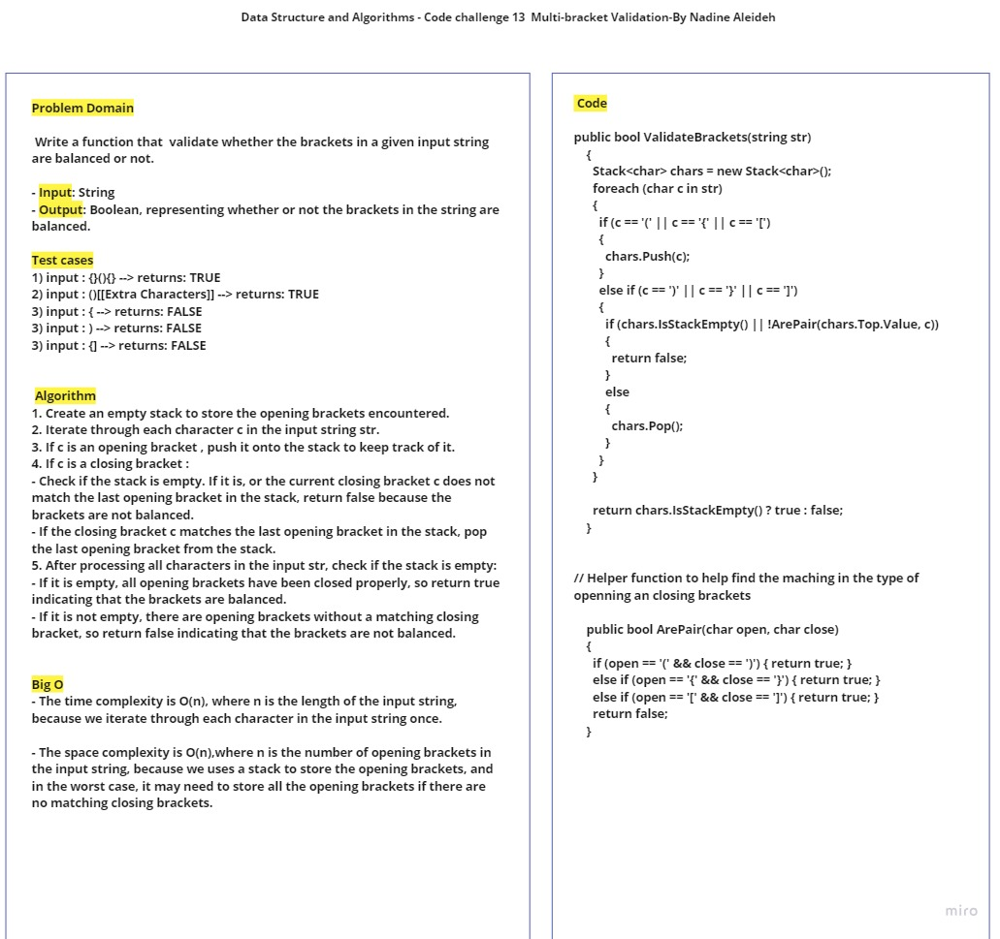

# Bracket Validation

The challenge is to validate whether the brackets in a given input string are balanced or not. Brackets are considered balanced if each opening bracket has a corresponding closing bracket in the correct order.

## Whiteboard Process


## Approach & Efficiency

**ValidateBrackets(string str) Method**: validate whether the brackets in a given input string are balanced or not.

- Input: String
- Output: Boolean, representing whether or not the brackets in the string are balanced.

- Algorithm:
  1. Create an empty stack to store the opening brackets encountered.
  2. Iterate through each character c in the input string str.
  3. If c is an opening bracket , push it onto the stack to keep track of it.
  4. If c is a closing bracket :
    - Check if the stack is empty. If it is, or the current closing bracket c does not match the last opening bracket in the stack, return false because the brackets are not balanced.
    - If the closing bracket c matches the last opening bracket in the stack, pop the last opening bracket from the stack.
  5. After processing all characters in the input str, check if the stack is empty:
    - If it is empty, all opening brackets have been closed properly, so return true indicating that the brackets are balanced.
    - If it is not empty, there are opening brackets without a matching closing bracket, so return false indicating that the brackets are not balanced.

- The time complexity is O(n), where n is the length of the input string, because we iterate through each character in the input string once.
- The space complexity is O(n),where n is the number of opening brackets in the input string, because we uses a stack to store the opening brackets, and in the worst case, it may need to store all the opening brackets if there are no matching closing brackets.


## Solution

```
public class BracketsValidation
  {
    public Stack<char> stack = new Stack<char>();

    public BracketsValidation()
    {
      stack = new Stack<char>();
    }
    public bool ValidateBrackets(string str)
    {
      Stack<char>? chars = new Stack<char>();
      foreach (char c in str)
      {
        if (c == '(' || c == '{' || c == '[')
        {
          chars.Push(c);
        }
        else if (c == ')' || c == '}' || c == ']')
        {
          if (chars.IsStackEmpty() || !ArePair(chars.Top.Value, c))
          {
            return false;
          }
          else
          {
            chars.Pop();
          }
        }
      }
      return chars.IsStackEmpty() ? true : false;
    }
    public bool ArePair(char open, char close)
    {
      if (open == '(' && close == ')') { return true; }
      else if (open == '{' && close == '}') { return true; }
      else if (open == '[' && close == ']') { return true; }
      return false;
    }
  }

```

## How to use

To use the `AnimalShelter` implementation, follow these steps:

1. Create an instance of the BracketsValidation class.
2. Call the ValidateBrackets method with the input string as an argument.
3. Display the result.

Here's an example of how to use it:

```
BracketsValidation bracketsValidation = new BracketsValidation();

string example1 = "{}(){}";
string example2 = "()[[Extra Characters]]";
string example3 = "[({}]";

Console.WriteLine("Example 1: {}(){} Returns: " + bracketsValidation.ValidateBrackets(example1)); // Output: True
Console.WriteLine("Example 2: ()[[Extra Characters]] Returns: " + bracketsValidation.ValidateBrackets(example2)); // Output: True
Console.WriteLine("Example 3: [({}] Returns: " + bracketsValidation.ValidateBrackets(example3)); // Output: False
```


Feel free to check the [The Tests](../../DataStructures/CC13/CC13Test/UnitTest1.cs) file for the complete Tests details.


