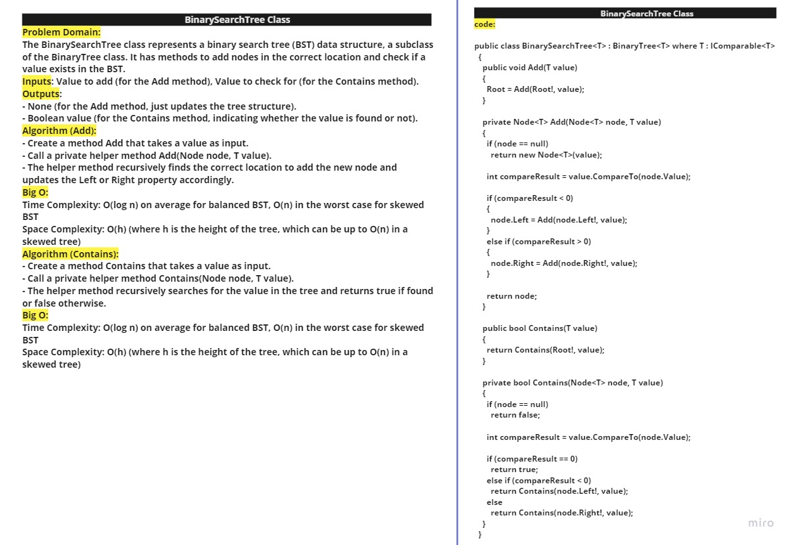
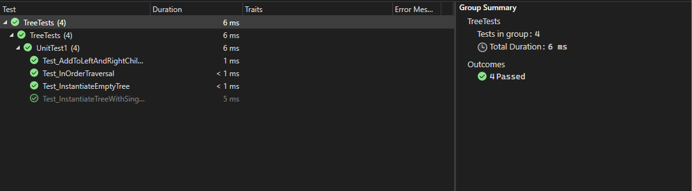

# CC15: Binary Search Tree

This challenge involves implementing a Binary Search Tree (BST) data structure as a subclass of the Binary Tree class. The BST should have methods to add nodes in the correct location and check if a given value exists in the tree.

## Approach & Efficiency
- Node Class: We define a Node class with properties for the value, left child node, and right child node. The constructor initializes these properties to null or the given values.
- BinaryTree Class: The BinaryTree class contains methods for PreOrder, InOrder, and PostOrder traversals. Each traversal method recursively traverses the tree and returns the nodes' values in the appropriate order.
- BinarySearchTree Class: The BinarySearchTree class is a subclass of the BinaryTree class. It has additional methods to Add nodes in the correct location and to check if a value exists in the tree using the Contains method.

**Time Complexity:**
- The time complexity for adding a node to the BST (Add method) is O(log n) on average for balanced BST, and O(n) in the worst case for skewed BST (where n is the number of nodes in the tree).
- The time complexity for traversals (PreOrder, InOrder, and PostOrder) is O(n) (where n is the number of nodes in the tree) as each node is visited once.

**Space Complexity:**
- The space complexity for traversals is O(h) (where h is the height of the tree), which can be up to O(n) in a skewed tree.
- The space complexity for adding a node is O(h) as the recursive stack consumes space during the function calls.

## Whiteboard Process



## Solution

```
public class Node<T>
  {
    public T Value { get; set; }

    public Node<T>? Left { get; set; }

    public Node<T>? Right { get; set; }

    public Node(T value)
    {
      Value = value;
      Left = null;
      Right = null;
    }
  }

```

```
public class BinaryTree<T>
  {
    public Node<T>? Root { get; set; }

    public BinaryTree()
    {
      Root = null;
    }

    public List<T> PreOrderTraversal()
    {
      List<T> result = new List<T>();
      PreOrderTraversal(Root!, result);
      return result;
    }

    private void PreOrderTraversal(Node<T> node, List<T> result)
    {
      if (node != null)
      {
        result.Add(node.Value);
        PreOrderTraversal(node.Left!, result);
        PreOrderTraversal(node.Right!, result);
      }
    }

    public List<T> InOrderTraversal()
    {
      List<T> result = new List<T>();
      InOrderTraversal(Root!, result);
      return result;
    }

    private void InOrderTraversal(Node<T> node, List<T> result)
    {
      if (node != null)
      {
        InOrderTraversal(node.Left!, result);
        result.Add(node.Value);
        InOrderTraversal(node.Right!, result);
      }
    }

    public List<T> PostOrderTraversal()
    {
      List<T> result = new List<T>();
      PostOrderTraversal(Root!, result);
      return result;
    }

    private void PostOrderTraversal(Node<T> node, List<T> result)
    {
      if (node != null)
      {
        PostOrderTraversal(node.Left!, result);
        PostOrderTraversal(node.Right!, result);
        result.Add(node.Value);
      }
    }

  }

```

```
public class BinarySearchTree<T> : BinaryTree<T> where T : IComparable<T>
  {
    public void Add(T value)
    {
      Root = Add(Root!, value);
    }

    private Node<T> Add(Node<T> node, T value)
    {
      if (node == null)
        return new Node<T>(value);

      int compareResult = value.CompareTo(node.Value);

      if (compareResult < 0)
      {
        node.Left = Add(node.Left!, value);
      }
      else if (compareResult > 0)
      {
        node.Right = Add(node.Right!, value);
      }

      return node;
    }

    public bool Contains(T value)
    {
      return Contains(Root!, value);
    }

    private bool Contains(Node<T> node, T value)
    {
      if (node == null)
        return false;

      int compareResult = value.CompareTo(node.Value);

      if (compareResult == 0)
        return true;
      else if (compareResult < 0)
        return Contains(node.Left!, value);
      else
        return Contains(node.Right!, value);
    }
  }

```

## How to use
To use the Binary Search Tree, follow these steps:

1. Instantiate a new instance of the BinarySearchTree class: `BinarySearchTree<int> tree = new BinarySearchTree<int>();`
2. Add nodes using the Add method: `tree.Add(5);`
3. Check if a value exists in the tree using the Contains method: `bool result = tree.Contains(5);`

Example:

```
BinarySearchTree<int> tree = new BinarySearchTree<int>();
tree.Add(5);
tree.Add(3);
tree.Add(7);

bool contains5 = tree.Contains(5); // true
bool contains4 = tree.Contains(4); // false
List<int> preOrder = tree.PreOrderTraversal(); // [5, 3, 7]
List<int> inOrder = tree.InOrderTraversal();   // [3, 5, 7]
List<int> postOrder = tree.PostOrderTraversal(); // [3, 7, 5]
```

## Tests

Go to [UnitTest1.cs](./TreeTests/UnitTest1.cs) to check the tests.


