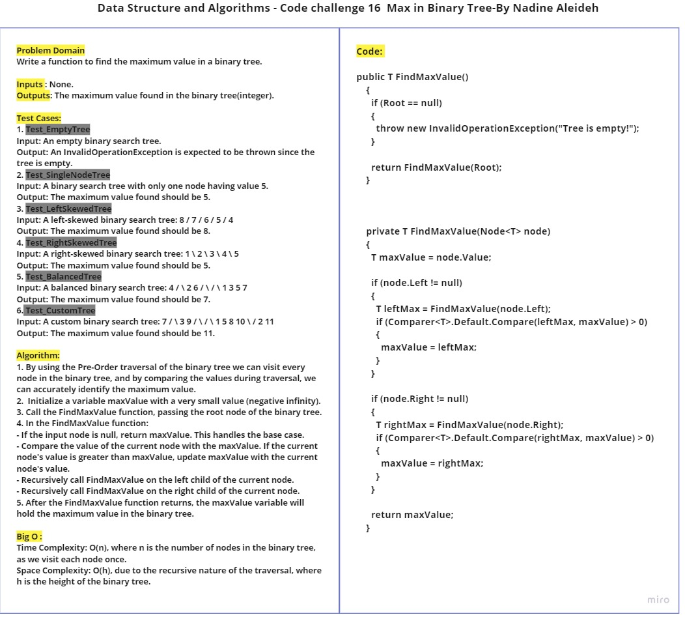
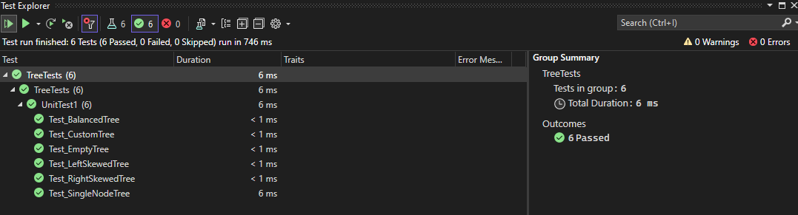

# CC16 Binary Search Tree: Find Maximum Value

This challenge requier implementing the FindMaxValue method for a Binary Search Tree (BST) data structure. The method should find and return the maximum value stored in the binary search tree.

- Inputs : None.
- Outputs: The maximum value found in the binary search tree(integer).

## Approach & Efficiency

- By using the In-Order traversal of the binary search tree and keep traversing to the right until we reach the rightmost node, which holds the maximum value.
- Start with the root node as the current node.
- While the current node has a right child, update the current node to be its right child (i.e., traverse to the right).
- When the current node does not have a right child, return its value as the maximum value.

Time Complexity: O(n) (where n is the number of nodes in the tree)
Space Complexity:  O(h) due to the recursive nature of the function.


## Whiteboard Process


## Solution

```
public class Node<T>
  {
    public T Value { get; set; }

    public Node<T>? Left { get; set; }

    public Node<T>? Right { get; set; }

    public Node(T value)
    {
      Value = value;
      Left = null;
      Right = null;
    }
  }

```

```
public class BinaryTree<T>
  {
    public Node<T>? Root { get; set; }

    public BinaryTree()
    {
      Root = null;
    }

    public T FindMaxValue()
    {
      if (Root == null)
      {
        throw new InvalidOperationException("Tree is empty!");
      }

      return FindMaxValue(Root);
    }

    private T FindMaxValue(Node<T> node)
    {
      T maxValue = node.Value;

      if (node.Left != null)
      {
        T leftMax = FindMaxValue(node.Left);
        if (Comparer<T>.Default.Compare(leftMax, maxValue) > 0)
        {
          maxValue = leftMax;
        }
      }

      if (node.Right != null)
      {
        T rightMax = FindMaxValue(node.Right);
        if (Comparer<T>.Default.Compare(rightMax, maxValue) > 0)
        {
          maxValue = rightMax;
        }
      }

      return maxValue;
    }
  }

```

## How to use
To use the Binary Search Tree, follow these steps:

1. Instantiate a new instance of the BinarySearchTree class: `BinarySearchTree<int> tree = new BinarySearchTree<int>();`
2. Add nodes using the Add method
3. Then call the FindMaxValue method to find the maximum value.

Example:

```
BinaryTree<int> tree = new BinaryTree<int>();
tree.Root = new Node<int>(10);
tree.Root.Left = new Node<int>(5);
tree.Root.Right = new Node<int>(20);
tree.Root.Left.Left = new Node<int>(3);
tree.Root.Left.Right = new Node<int>(8);

int max = tree.FindMaxValue();
Console.WriteLine("Maximum value in the binary tree: " + max);
```

## Tests

Go to [UnitTest1.cs](../TreeTests/UnitTest1.cs) to check the tests.


