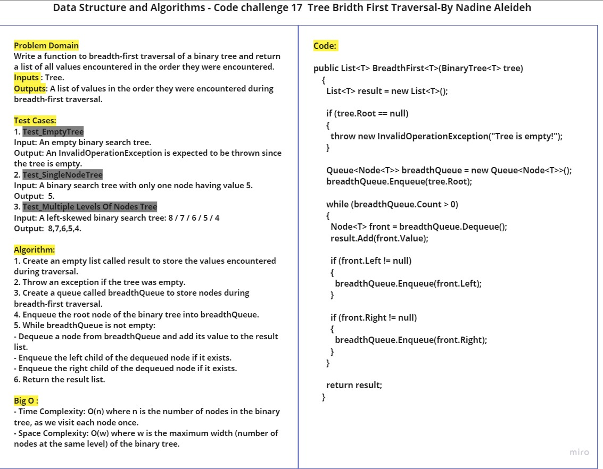
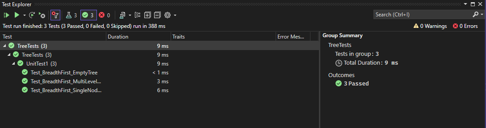

# CC17:  Bridth First Traversal in Binary Tree

This challenge requier implementing a breadth-first traversal function for a binary tree. The function should return a list of all values encountered during the traversal, in the order they were encountered.

- Inputs :Binary Tree.
- Outputs: A list of values in the order they were encountered during breadth-first traversal.

## Approach & Efficiency

1. Create an empty list called result to store the values encountered during traversal.
2. Throw an exception if the tree was empty.
3. Create a queue called breadthQueue to store nodes during breadth-first traversal.
4. Enqueue the root node of the binary tree into breadthQueue.
5. While breadthQueue is not empty:
   - Dequeue a node from breadthQueue and add its value to the result list.
   - Enqueue the left child of the dequeued node if it exists.
   - Enqueue the right child of the dequeued node if it exists.
6. Return the result list.

- Time Complexity: O(n), where n is the number of nodes in the binary tree, as we visit each node once.
- Space Complexity: O(h), due to the recursive nature of the traversal, where h is the height of the binary tree.


## Whiteboard Process


## Solution


```
public class BridthFirstClass
  {
    public List<T> BreadthFirst<T>(BinaryTree<T> tree)
    {
      List<T> result = new List<T>();

      if (tree.Root == null)
      {
        throw new InvalidOperationException("Tree is empty!");
      }

      Queue<Node<T>> breadthQueue = new Queue<Node<T>>();
      breadthQueue.Enqueue(tree.Root);

      while (breadthQueue.Count > 0)
      {
        Node<T> front = breadthQueue.Dequeue();
        result.Add(front.Value);

        if (front.Left != null)
        {
          breadthQueue.Enqueue(front.Left);
        }

        if (front.Right != null)
        {
          breadthQueue.Enqueue(front.Right);
        }
      }

      return result;
    }
  }

```

## How to use

To use the Binary Search Tree, follow these steps:

1. Instantiate a new instance of the BinarySearchTree class: `BinaryTree<int> tree = new BinaryTree<int>();`
2. Add nodes
3. Then call theBreadthFirst method and pass the tree to it.

Example:

```
BinaryTree<int> tree = new BinaryTree<int>();

      tree.Root = new Node<int>(2);
      tree.Root.Left = new Node<int>(7);
      tree.Root.Right = new Node<int>(5);
      tree.Root.Left.Left = new Node<int>(2);
      tree.Root.Left.Right = new Node<int>(6);
      tree.Root.Right.Left = new Node<int>(9);
      tree.Root.Right.Right = new Node<int>(5);

      BridthFirstClass bridthFirstClass = new BridthFirstClass();

      List<int> breadthFirstResult = bridthFirstClass.BreadthFirst(tree);

      Console.WriteLine("Breadth First Traversal: " + string.Join(", ", breadthFirstResult));
```

## Tests

Go to [UnitTest1.cs](../TreeTests/UnitTest1.cs) to check the tests.


