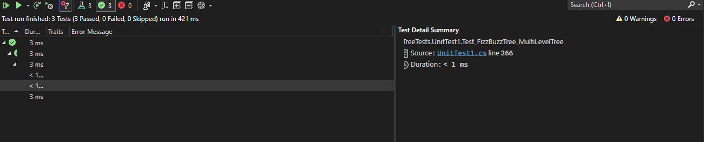

# CC18:  FizzBuzz K-ary Tree Transformation

In this challenge, you are tasked with implementing a function that performs a FizzBuzz transformation on a K-ary tree. The FizzBuzz transformation involves replacing values in the tree according to specific rules:
- If the value is divisible by 3, replace it with "Fizz"
- If the value is divisible by 5, replace it with "Buzz"
- If the value is divisible by both 3 and 5, replace it with "FizzBuzz"
- If none of the above conditions are met, turn the number into a string.

- Inputs : A k-ary tree containing integer values.
- Outputs: A new k-ary tree with values modified according to the FizzBuzz rules.

## Approach & Efficiency

1. Create a new k-ary tree resultTree with the root node containing the FizzBuzz-modified value of the root node in the source tree.
2. Call the FizzBuzzTree recursive helper function on the root nodes of the source tree and the result tree.
3. In the FizzBuzzTree helper function:
  - For each child node of the source node, create a corresponding child node in the result tree with the FizzBuzz-modified value of the child node's value.
  - Recursively call the FizzBuzzTree helper function on the child nodes of both the source and result trees.


- Time Complexity: O(n), where n is the number of nodes in the k-ary tree, as we visit each node once.
- Space Complexity: O(h), where h is the maximum height of the k-ary tree, due to the recursive nature of the traversal.


## Whiteboard Process


## Solution


```
public class TreeNode<T>
  {
    public T Value { get; set; }
    public List<TreeNode<T>> Children { get; set; }

    public TreeNode(T value)
    {
      Value = value;
      Children = new List<TreeNode<T>>();
    }
  }
```

```
public class KaryTree<T>
  {
    public TreeNode<T> Root { get; set; }

    public KaryTree()
    {
      Root = null;
    }
  }
```

```
 public class FizzBuzzTreeClass
  {
    public KaryTree<string> FizzBuzzTree(KaryTree<int> tree)
    {
      if (tree.Root == null)
      {
        throw new InvalidOperationException("Tree is empty!");
      }

      KaryTree<string> resultTree = new KaryTree<string>();
      resultTree.Root = new TreeNode<string>(FizzBuzzValue(tree.Root.Value));

      FizzBuzzTree(tree.Root, resultTree.Root);

      return resultTree;
    }

    public static void FizzBuzzTree(TreeNode<int> sourceNode, TreeNode<string> destinationNode)
    {
      foreach (var childNode in sourceNode.Children)
      {
        TreeNode<string> newChild = new TreeNode<string>(FizzBuzzValue(childNode.Value));
        destinationNode.Children.Add(newChild);

        FizzBuzzTree(childNode, newChild);
      }
    }

    public static string FizzBuzzValue(int value)
    {
      if (value % 3 == 0 && value % 5 == 0)
      {
        return "FizzBuzz";
      }
      else if (value % 3 == 0)
      {
        return "Fizz";
      }
      else if (value % 5 == 0)
      {
        return "Buzz";
      }
      else
      {
        return value.ToString();
      }
    }
  }
```
## How to use


Example:

```
FizzBuzzTreeClass fizzBuzzTreeClass = new FizzBuzzTreeClass();
      KaryTree<int> multiLevelTree = new KaryTree<int>();
      multiLevelTree.Root = new TreeNode<int>(10);
      var root = multiLevelTree.Root;
      root.Children.Add(new TreeNode<int>(9));
      root.Children.Add(new TreeNode<int>(12));
      root.Children[0].Children.Add(new TreeNode<int>(15));
      root.Children[0].Children[0].Children.Add(new TreeNode<int>(7));
      root.Children[1].Children.Add(new TreeNode<int>(30));
      root.Children[1].Children[0].Children.Add(new TreeNode<int>(22));

      // Perform FizzBuzz transformation

      KaryTree<string> fizzBuzzTree = fizzBuzzTreeClass.FizzBuzzTree(multiLevelTree);

      //  original tree values
      Console.WriteLine("Original Tree:");
      PrintTreeValues(multiLevelTree.Root);

      //  FizzBuzz tree values
      Console.WriteLine("\nFizzBuzz Tree:");
      PrintTreeValues(fizzBuzzTree.Root);
    }

    static void PrintTreeValues<T>(TreeNode<T> node)
    {
      Console.WriteLine(node.Value);

      foreach (var child in node.Children)
      {
        PrintTreeValues(child);
      }
    }

  }
```

## Tests

Go to [UnitTest1.cs](../TreeTests/UnitTest1.cs) to check the tests.


