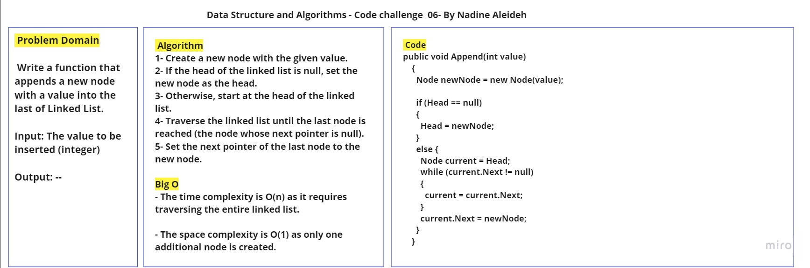
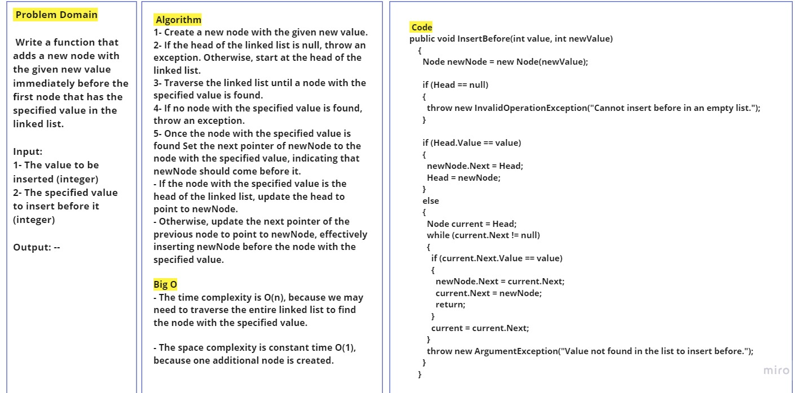
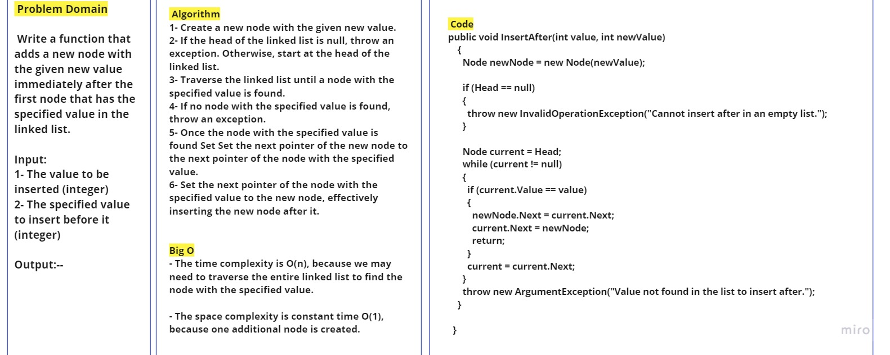
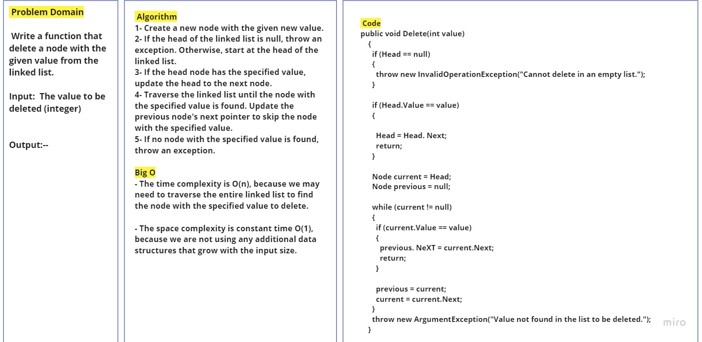
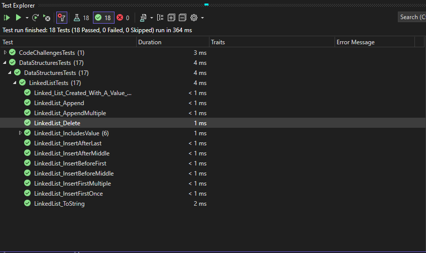

# Challenge Title: LinkedList Implementation

## Description

This code challenge focuses on implementing various operations on a singly linked list. The linked list class provides methods for appending a node at the end, inserting a node before or after a specified node, and deleting a node with a given value. The code challenge also includes unit tests to validate the functionality of these operations. The LinkedList class provides the following operations:

## Methods Inputs & Outputs , Approach & Efficiency

- **Append(value):** appends a new node with a value into the last of Linked List.

  - Input: The value to be appended (integer).
  - Output: None.
  - Approach:
   1. Create a new node with the given value.
   2. If the linked list is empty, set the new node as the head.
   3. Otherwise, traverse the linked list until reaching the last node.
   4. Set the next pointer of the last node to the new node.

  - Time Complexity: O(n)
  - Space Complexity: O(1)

- **Insert Before(value, new value):** adds a new node with the given new value immediately before the first node that has the specified value in the linked list.
  - Input: Input: The value to be inserted (integer), The specified value to insert before it (integer).
  - Output: None.
  - Approach:
   1. Create a new node with the given new value.
   2. If the head of the linked list is null, throw an exception. Otherwise, start at the head of the linked list.
   3. Traverse the linked list until a node with the specified value is found.
   4. If no node with the specified value is found, throw an exception.
   5. Once the node with the specified value is found Set the next pointer of newNode to the node with the specified value, indicating that newNode should come before it.
   6. If the node with the specified value is the head of the linked list, update the head to point to newNode. Otherwise, update the next pointer of the previous node to point to newNode, effectively inserting newNode before the node with the specified value.

  - Time Complexity: O(n)
  - Space Complexity: O(1)

- **InsertAfter(value, new value):** adds a new node with the given new value immediately after the first node that has the specified value in the linked list.
  - Input: Input: The value to be inserted (integer), The specified value to insert before it (integer).
  - Output: None.
  - Approach:
   1. Create a new node with the given new value.
   2. If the head of the linked list is null, throw an exception. Otherwise, start at the head of the linked list.
   3. Traverse the linked list until a node with the specified value is found.
   4. If no node with the specified value is found, throw an exception.
   5. Once the node with the specified value is found Set Set the next pointer of the new node to the next pointer of the node with the specified value.
   6. Set the next pointer of the node with the specified value to the new node, effectively inserting the new node after it.

  - Time Complexity: O(n)
  - Space Complexity: O(1)

  - **Delete(value):** delete a node with the given value from the linked list.

  - Input: The value to be deleted (integer).
  - Output: None.
  - Approach:
   1. Create a new node with the given new value.
   2. If the head of the linked list is null, throw an exception. Otherwise, start at the head of the linked list.
   3. If the head node has the specified value, update the head to the next node.
   4. Traverse the linked list until the node with the specified value is found. Update the previous node's next pointer to skip the node with the specified value.
   5. If no node with the specified value is found, throw an exception.

  - Time Complexity: O(n)
  - Space Complexity: O(1)

## Whiteboard Process







## Solution & Tests

- The code for the linked list implementation can be found in the [Node.cs](../Node.cs) and [LinkedList.cs](../LinkedList.cs) files.
- To run the code, create an instance of the LinkedList class and call the appropriate methods.
- Example usage write it in Main method in the Program.cs:

```

try { 
      // Create a new linked list
      LinkedList linkedList = new LinkedList();

      // Insert nodes
      linkedList.InsertFirst(4);
      linkedList.InsertFirst(3);
      linkedList.InsertFirst(2);
      linkedList.InsertFirst(1);
      linkedList.Append(5);
      linkedList.Append(6);

      linkedList.InsertBefore(1, 0);
      linkedList.InsertAfter(6, 7);
      linkedList.Delete(3);

      // Generate string representation
      string listString = linkedList.ToString();
      Console.WriteLine($"LinkedList: {listString}");

      // Search for a value
      bool containsValue2 = linkedList.IsIncludes(2);
      bool containsValue10 = linkedList.IsIncludes(10);
      Console.WriteLine($"Contains value 2: {containsValue2}");
      Console.WriteLine($"Contains value 10: {containsValue10}");

      }
      catch(InvalidOperationException ex)
      {
        Console.WriteLine($"InvalidOperationException: {ex.Message}");

      }
      catch(ArgumentException ex)
      {
        Console.WriteLine($"ArgumentException: {ex.Message}");
      }
      finally
      {
        Console.WriteLine("Program done");
      }

```

This is a basic example demonstrating the usage of the LinkedList class. You can customize and expand it based on your requirements.

Feel free to check the [LinkedList.cs](../LinkedList.cs) file for the complete implementation details.

Also, Feel free to check the [LinkedListTests.cs](../../DataStructuresTests/LinkedListTests.cs) file for the complete Tests details.


