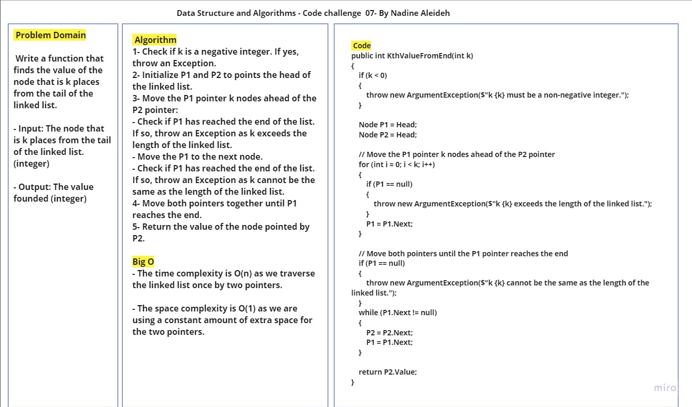
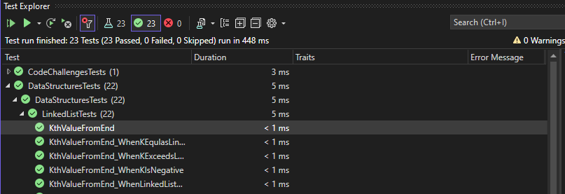

# Challenge Title: LinkedList Implementation

## Description

This code challenge focuses on  finding the value k places from the end of the list, and finding the middle node of the list.

## Method Inputs & Outputs , Approach & Efficiency

- **KthValueFromEnd(k):** finds the value of the node that is k places from the tail of the linked list.

  - Input: The node that is k places from the tail of the linked list (integer).
  - Output: The value founded (integer).
  - Approach:
    1. Check if k is a negative integer. If yes, throw an Exception.
    2. Initialize P1 and P2 to points the head of the linked list.
    3. Move the P1 pointer k nodes ahead of the P2 pointer:
      - Check if P1 has reached the end of the list. If so, throw an Exception as k exceeds the length of the linked list.
      - Move the P1 to the next node. 
      - Check if P1 has reached the end of the list. If so, throw an Exception as k cannot be the same as the length of the linked list. 
    4. Move both pointers together until P1 reaches the end.
    5. Return the value of the node pointed by P2.

  - Time Complexity: O(n)
  - Space Complexity: O(1)

## Whiteboard Process




## Solution & Tests

- The code for the linked list implementation can be found in the [Node.cs](../Node.cs) and [LinkedList.cs](../LinkedList.cs) files.
- To run the code, create an instance of the LinkedList class and call the appropriate methods.
- Example usage write it in Main method in the Program.cs:

```

try { 
      // Create a new linked list
      LinkedList linkedList = new LinkedList();

      // Insert nodes
      linkedList.InsertFirst(4);
      linkedList.InsertFirst(3);
      linkedList.InsertFirst(2);
      linkedList.InsertFirst(1);
      linkedList.Append(5);
      linkedList.Append(6);

      linkedList.InsertBefore(1, 0);
      linkedList.InsertAfter(6, 7);
      linkedList.Delete(3);

      // Generate string representation
      string listString = linkedList.ToString();
      Console.WriteLine($"LinkedList: {listString}");

      // Search for a value
      bool containsValue2 = linkedList.IsIncludes(2);
      bool containsValue10 = linkedList.IsIncludes(10);
      Console.WriteLine($"Contains value 2: {containsValue2}");
      Console.WriteLine($"Contains value 10: {containsValue10}");
        

        for (int i =0; i< 7; i++)
        {
          Console.WriteLine($"{i}th value from end: {linkedList.KthValueFromEnd(i)}");
        }

        Console.WriteLine($"-4th value from end: {linkedList.KthValueFromEnd(-4)}");
       //Console.WriteLine($"7th value from end: {linkedList.KthValueFromEnd(7)}");
       //Console.WriteLine($"10th value from end: {linkedList.KthValueFromEnd(10)}");

      }
      catch(InvalidOperationException ex)
      {
        Console.WriteLine($"InvalidOperationException: {ex.Message}");

      }
      catch(ArgumentException ex)
      {
        Console.WriteLine($"ArgumentException: {ex.Message}");
      }

      finally
      {
        Console.WriteLine("Program done");
      }

```

This is a basic example demonstrating the usage of the LinkedList class. You can customize and expand it based on your requirements.

Feel free to check the [LinkedList.cs](../LinkedList.cs) file for the complete implementation details.

Also, Feel free to check the [LinkedListTests.cs](../../DataStructuresTests/LinkedListTests.cs) file for the complete Tests details.


