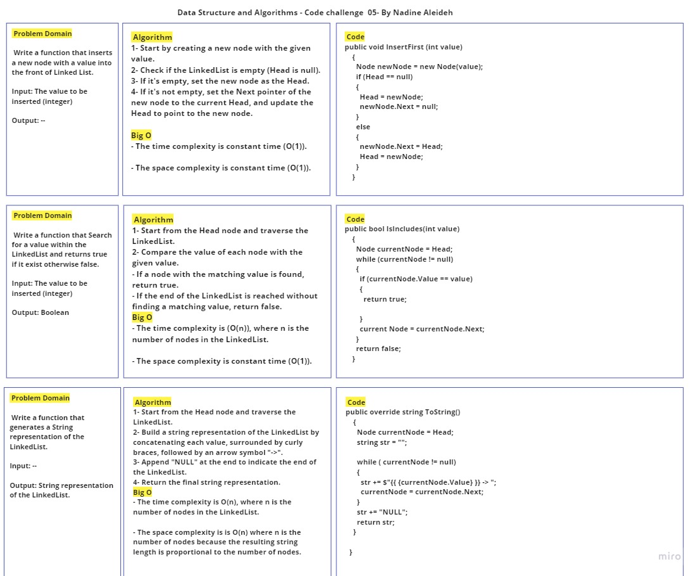
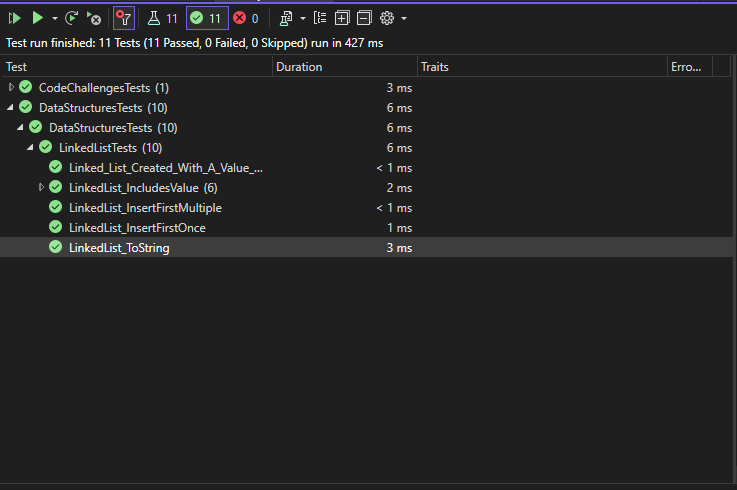

# Challenge Title: LinkedList Implementation

## Description

This challenge involves implementing a linked list data structure in C#. A linked list is a linear data structure where elements are stored in separate nodes, and each node contains a reference (link) to the next node in the list. The LinkedList class provides the following operations:

## Methods Inputs & Outputs , Approach & Efficiency

- **InsertFirst(value):** Adds a new node with the given value to the head of the list.
  - Input: The value to be inserted (integer).
  - Output: None.
  - Approach: Create a new node and update the head pointer to the new node.
  - Time Complexity: O(1)
  - Space Complexity: O(1)

- **IsIncludes(value):** Checks if a node with the given value exists in the list.
  - Input: The value to search for (integer).
  - Output: Boolean (true if the value exists, false otherwise).
  - Approach: Traverse the linked list and compare the values of each node with the target value.
  - Time Complexity: O(n)
  - Space Complexity: O(1)

- **ToString():** Generates a string representation of the linked list.
  - Input: None.
  - Output: A string representing all the values in the linked list, formatted as "{ value1 } -> { value2 } -> ... -> NULL".
  - Approach: Traverse the linked list and build a string representation of the values.
  - Time Complexity: O(n)
  - Space Complexity: O(n)

## Whiteboard Process




## Solution & Tests

- The code for the linked list implementation can be found in the [Node.cs](../Node.cs) and [LinkedList.cs](../LinkedList.cs) files.
- To run the code, create an instance of the LinkedList class and call the appropriate methods.
- Example usage write it in Main method in the Program.cs:

```

// Create a new linked list
LinkedList linkedList = new LinkedList();

// Insert nodes
linkedList.InsertFirst(4);
linkedList.InsertFirst(3);
linkedList.InsertFirst(2);
linkedList.InsertFirst(1);

// Generate string representation
string listString = linkedList.ToString();
Console.WriteLine($"LinkedList: {listString}");

// Search for a value
bool containsValue2 = linkedList.IsIncludes(2);
bool containsValue10 = linkedList.IsIncludes(10);
Console.WriteLine($"Contains value 2: {containsValue2}");
Console.WriteLine($"Contains value 10: {containsValue10}");

```

This is a basic example demonstrating the usage of the LinkedList class. You can customize and expand it based on your requirements.

Feel free to check the [LinkedList.cs](../LinkedList.cs) file for the complete implementation details.

Also, Feel free to check the [LinkedListTests.cs](../../DataStructuresTests/LinkedListTests.cs) file for the complete Tests details.


