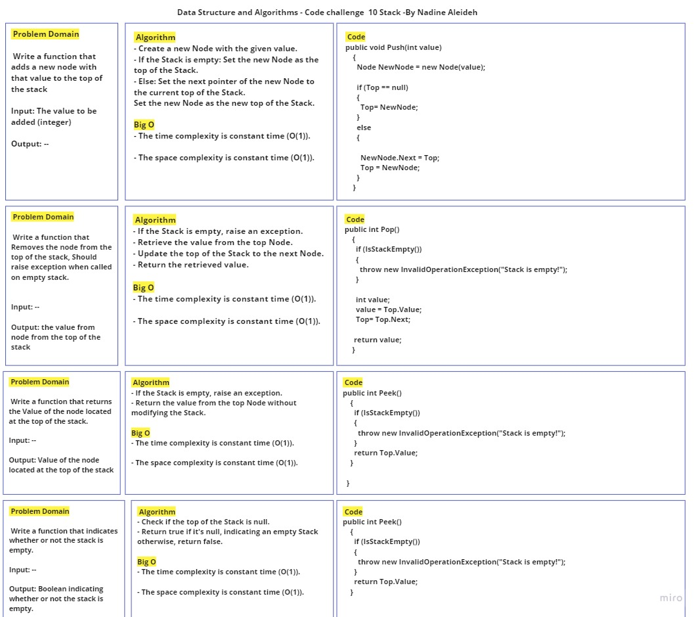
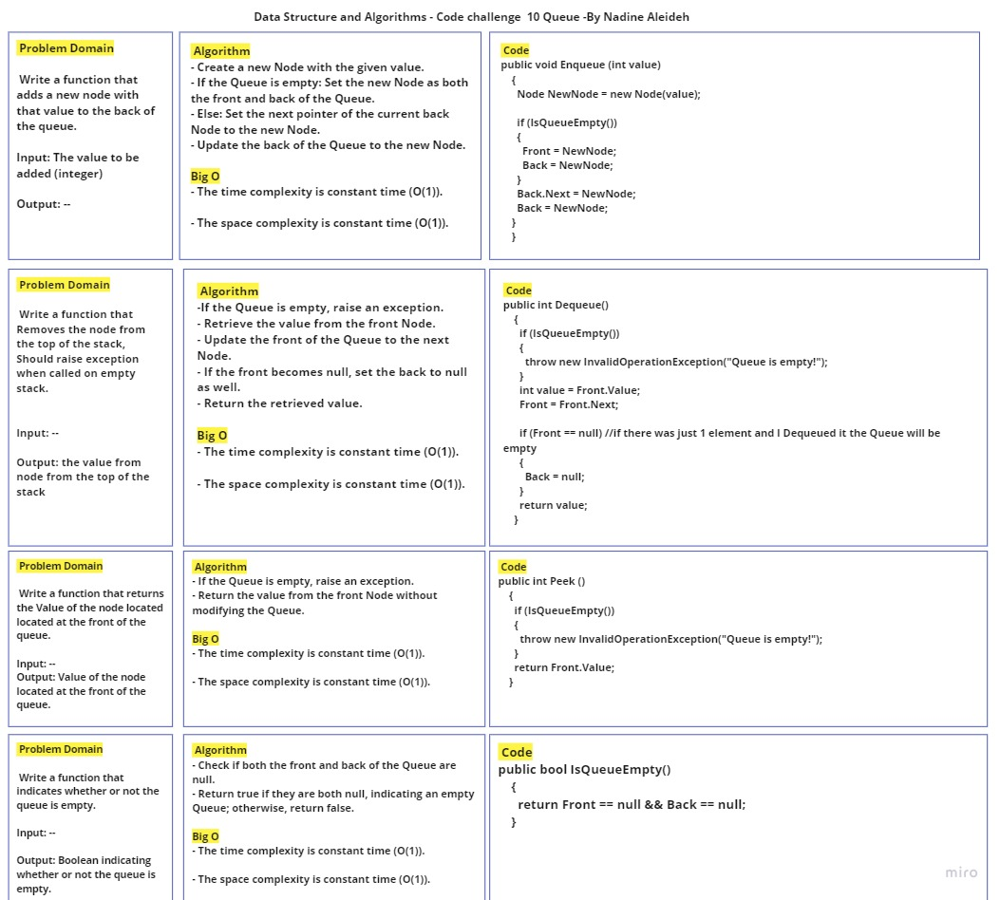
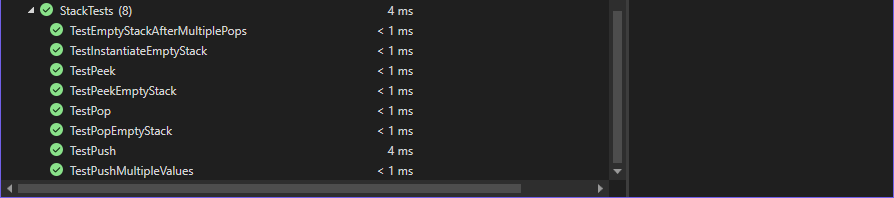
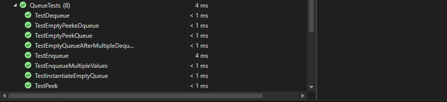

## Stack and Queue Implementation using Linked List

This implementation provides a Stack and Queue data structure using a Linked List as the underlying data storage mechanism. The Stack follows the Last-In-First-Out (LIFO) principle, while the Queue follows the First-In-First-Out (FIFO) principle.

## Methods Inputs & Outputs , Approach & Efficiency

### Stack Methods:

- `void Push(int value)`
  - Adds a new element with the given value to the top of the stack.
  - Input: `int value` - The value to be added to the stack.
  - Output: None.
  - Approach:
   - Create a new Node with the given value.
   - If the Stack is empty: Set the new Node as the top of the Stack.
   - Else: Set the next pointer of the new Node to the current top of the Stack.
   - Set the new Node as the new top of the Stack.
  - Time Complexity: O(1)
  - Space Complexity: O(1)

- `int Pop()`
  - Removes and returns the element from the top of the stack.
  - Output: The value of the element removed from the stack.
  - Approach:
   - If the Stack is empty, raise an exception.
   - Retrieve the value from the top Node.
   - Update the top of the Stack to the next Node.
   - Return the retrieved value.
  - Time Complexity: O(1)
  - Space Complexity: O(1)

- `int Peek()`
  - Returns the value of the element at the top of the stack without removing it.
  - Output: The value of the element at the top of the stack.
  - Approach:
   - If the Stack is empty, raise an exception.
   - Return the value from the top Node without modifying the Stack.
  - Time Complexity: O(1)
  - Space Complexity: O(1)

- `bool IsEmpty()`
  - Checks whether the stack is empty.
  - Output: Returns `true` if the stack is empty; otherwise, returns `false`.
  - Approach:
   - Check if the top of the Stack is null.
   - Return true if it's null, indicating an empty Stack otherwise, return false.
  - Time Complexity: O(1)
  - Space Complexity: O(1)

### Queue Methods:

- `void Enqueue(int value)`
  - Adds a new element with the given value to the back of the queue.
  - Input: `int value` - The value to be added to the queue.
  - Output: None.
  - Approach:
   - Create a new Node with the given value.
   - If the Queue is empty: Set the new Node as both the front and back of the Queue.
   - Else: Set the next pointer of the current back Node to the new Node.
   - Update the back of the Queue to the new Node.
  - Time Complexity: O(1)
  - Space Complexity: O(1)

- `int Dequeue()`
  - Removes and returns the element from the front of the queue.
  - Output: The value of the element removed from the queue.
  - Approach:
   -If the Queue is empty, raise an exception.
   - Retrieve the value from the front Node.
   - Update the front of the Queue to the next Node.
   - If the front becomes null, set the back to null as well.
   - Return the retrieved value.
  - Time Complexity: O(1)
  - Space Complexity: O(1)

- `int Peek()`
  - Returns the value of the element at the front of the queue without removing it.
  - Output: The value of the element at the front of the queue.
  - Approach:
   - If the Queue is empty, raise an exception.
   - Return the value from the front Node without modifying the Queue.
  - Time Complexity: O(1)
  - Space Complexity: O(1)

- `bool IsEmpty()`
  - Checks whether the queue is empty.
  - Output: Returns `true` if the queue is empty; otherwise, returns `false`.
   - Approach:
   - Check if both the front and back of the Queue are null.
   - Return true if they are both null, indicating an empty Queue; otherwise, return false.
  - Time Complexity: O(1)
  - Space Complexity: O(1)

## Whiteboard Process




## Solution & Tests

- The code for the Stack and Queue implementations can be found in the [Node.cs](../Node.cs) , [Stack.cs](../Stack.cs) and [Queue.cs](../Queue.cs) files.
- To run the code, create an instance of the Stack and Queue classes and call the appropriate methods.
- Example usage write it in Main method in the Program.cs:

```

Stack stack = new Stack();
stack.Push(1);
stack.Push(2);
stack.Push(3);

Console.WriteLine(stack.Peek()); // Output: 3

Console.WriteLine(stack.Pop()); // Output: 3
Console.WriteLine(stack.Pop()); // Output: 2

Console.WriteLine(stack.IsEmpty()); // Output: False

Console.WriteLine(stack.Pop()); // Output: 1

Console.WriteLine(stack.IsEmpty()); // Output: True

Queue queue = new Queue();
queue.Enqueue(1);
queue.Enqueue(2);
queue.Enqueue(3);

Console.WriteLine(queue.Peek()); // Output: 1

Console.WriteLine(queue.Dequeue()); // Output: 1
Console.WriteLine(queue.Dequeue()); // Output: 2

Console.WriteLine(queue.IsEmpty()); // Output: False

Console.WriteLine(queue.Dequeue()); // Output: 3

Console.WriteLine(queue.IsEmpty()); // Output: True

```

This is a basic example demonstrating the usage of the Stack and Queue classes. You can customize and expand it based on your requirements.

Feel free to check the [Stack.cs](../Stack.cs) and [Queue.cs](../Queue.cs) files for the complete implementation details.

Also, Feel free to check the [StackTests.cs](../../DataStructuresTests/StackTests.cs) and [QueueTests.cs](../../DataStructuresTests/QueueTests.cs) files for the complete Tests details.



