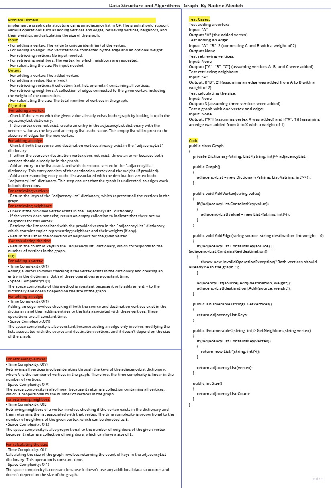
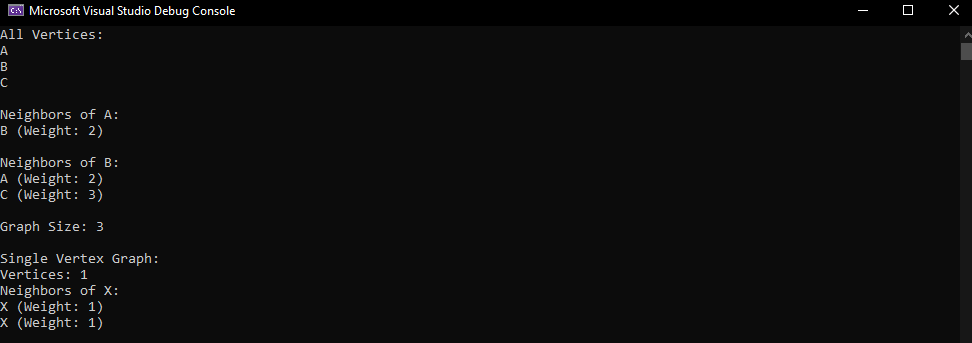
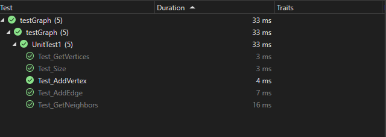

# Graph
Find the First Repeated Word in a Stringimplement a graph data structure using an adjacency list in C#. The graph should support various operations such as adding vertices and edges, retrieving vertices, neighbors, and their weights, and calculating the size of the graph.

## Whiteboard Process




## Solution

   ```
       var graph = new Graph();


      graph.AddVertex("A");
      graph.AddVertex("B");
      graph.AddVertex("C");


      graph.AddEdge("A", "B", 2);
      graph.AddEdge("B", "C", 3);

      var vertices = graph.GetVertices();
      Console.WriteLine("All Vertices:");
      foreach (var vertex in vertices)
      {
        Console.WriteLine(vertex);
      }


      var neighborsOfA = graph.GetNeighbors("A");
      Console.WriteLine("\nNeighbors of A:");
      foreach (var neighbor in neighborsOfA)
      {
        Console.WriteLine($"{neighbor.Item1} (Weight: {neighbor.Item2})");
      }


      var neighborsOfB = graph.GetNeighbors("B");
      Console.WriteLine("\nNeighbors of B:");
      foreach (var neighbor in neighborsOfB)
      {
        Console.WriteLine($"{neighbor.Item1} (Weight: {neighbor.Item2})");
      }


      var graphSize = graph.Size();
      Console.WriteLine($"\nGraph Size: {graphSize}");


      var singleVertexGraph = new Graph();
      singleVertexGraph.AddVertex("X");
      singleVertexGraph.AddEdge("X", "X", 1);

      Console.WriteLine("\nSingle Vertex Graph:");
      Console.WriteLine($"Vertices: {singleVertexGraph.Size()}");
      var neighborsOfX = singleVertexGraph.GetNeighbors("X");
      Console.WriteLine("Neighbors of X:");
      foreach (var neighbor in neighborsOfX)
      {
        Console.WriteLine($"{neighbor.Item1} (Weight: {neighbor.Item2})");
      }
   ```

   ## Output
   

## Test 


