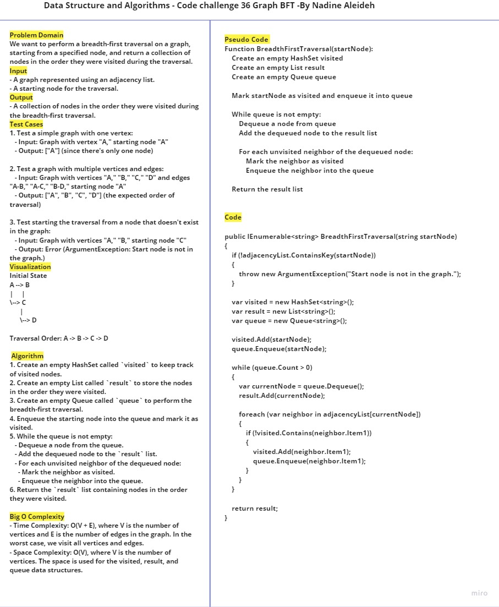
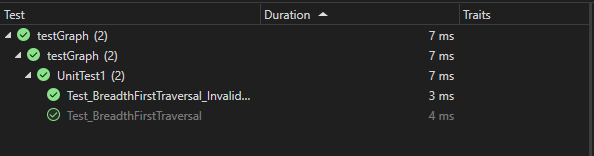

# Graph BFT
perform a breadth-first traversal on a graph, starting from a specified node, and return a collection of nodes in the order they were visited during the traversal.
## Whiteboard Process




## Solution


   ```
       var graph = new Graph();

      // Add vertices and edges to the graph
      graph.AddVertex("A");
      graph.AddVertex("B");
      graph.AddVertex("C");
      graph.AddVertex("D");
      graph.AddEdge("A", "B");
      graph.AddEdge("A", "C");
      graph.AddEdge("B", "D");

      string startNode = "A"; // Specify the starting node for traversal

      // Perform breadth-first traversal and display the result
      var traversalResult = graph.BreadthFirstTraversal(startNode);

      Console.WriteLine("Breadth-First Traversal:");
      foreach (var node in traversalResult)
      {
        Console.Write(node + " ");
      }
      Console.WriteLine();
    }
   ```

   ## Output
   

## Test 


