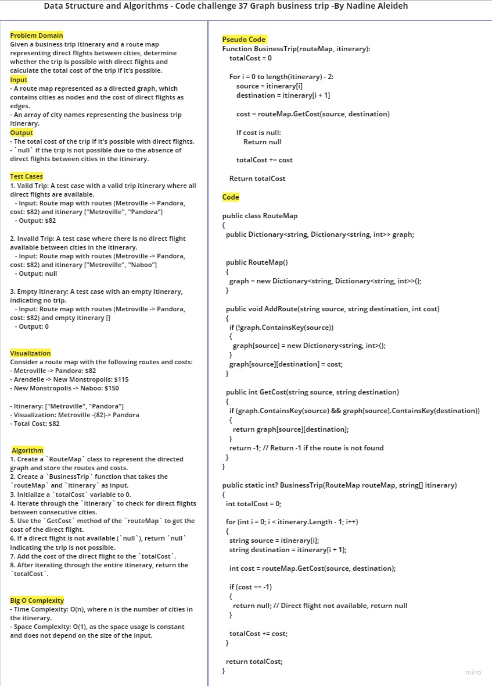

# Graph business trip
Given a business trip itinerary and a route map representing direct flights between cities, determine whether the trip is possible with direct flights and calculate the total cost of the trip if it's possible.

## Whiteboard Process




## Solution


   ```
  var routeMap = new RouteMap();
      // Add routes to the route map
      routeMap.AddRoute("Metroville", "Pandora", 82);
      routeMap.AddRoute("Arendelle", "New Monstropolis", 115);
      routeMap.AddRoute("New Monstropolis", "Naboo", 150);

      // Test cases
      string[] itinerary1 = { "Metroville", "Pandora" };
      string[] itinerary2 = { "Arendelle", "New Monstropolis", "Naboo" };
      string[] itinerary3 = { "Naboo", "Pandora" };
      string[] itinerary4 = { "Narnia", "Arendelle", "Naboo" };

      Console.WriteLine("Input: [" + string.Join(", ", itinerary1) + "]");
      int? result1 = BusinessTrip(routeMap, itinerary1);
      Console.WriteLine("Output: " + (result1.HasValue ? "$" + result1 : "null"));
      Console.WriteLine();

      Console.WriteLine("Input: [" + string.Join(", ", itinerary2) + "]");
      int? result2 = BusinessTrip(routeMap, itinerary2);
      Console.WriteLine("Output: " + (result2.HasValue ? "$" + result2 : "null"));
      Console.WriteLine();

      Console.WriteLine("Input: [" + string.Join(", ", itinerary3) + "]");
      int? result3 = BusinessTrip(routeMap, itinerary3);
      Console.WriteLine("Output: " + (result3.HasValue ? "$" + result3 : "null"));
      Console.WriteLine();

      Console.WriteLine("Input: [" + string.Join(", ", itinerary4) + "]");
      int? result4 = BusinessTrip(routeMap, itinerary4);
      Console.WriteLine("Output: " + (result4.HasValue ? "$" + result4 : "null"));
   ```

   ## Output
   

## Test 


