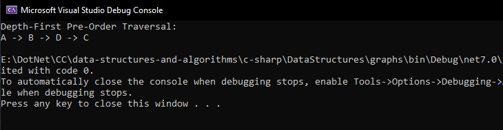

# Graph DFT
conducting a depth-first pre-order traversal on a graph. Depth-first pre-order traversal visits each node in the graph and records nodes in the order they are visited.
## Whiteboard Process


## Solution


   ```
  var graph = new Graph();
      graph.AddVertex("A");
      graph.AddVertex("B");
      graph.AddVertex("C");
      graph.AddVertex("D");
      graph.AddEdge("A", "B");
      graph.AddEdge("A", "C");
      graph.AddEdge("B", "D");

      var result = graph.DepthFirstPreOrder("A");

      Console.WriteLine("Depth-First Pre-Order Traversal:");
      Console.WriteLine(string.Join(" -> ", result));
   ```

   ## Output
   

## Test 


