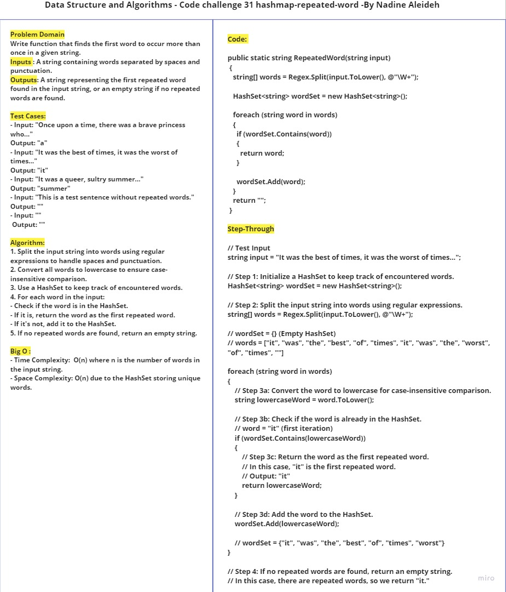
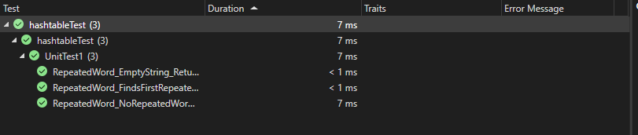

# Challenge Title
Find the First Repeated Word in a String

## Whiteboard Process



## Approach & Efficiency
For this challenge, I use a HashSet to keep track of encountered words in a case-insensitive manner. I split the input string into words, convert them to lowercase, and check if each word is already in the HashSet. If a word is found in the HashSet, it's the first repeated word, and I return it. If no repeated words are found, I return an empty string.

- Time Complexity: O(n) where n is the number of words in the input string.
- Space Complexity: O(n) due to the HashSet storing unique words.

## Solution

   ```
       public static string RepeatedWord(string input)
       {
           HashSet<string> wordSet = new HashSet<string>();
           string[] words = Regex.Split(input.ToLower(), @"\W+");

           foreach (string word in words)
           {
               string lowercaseWord = word.ToLower();
               if (wordSet.Contains(lowercaseWord))
               {
                   return lowercaseWord;
               }
               wordSet.Add(lowercaseWord);
           }

           return "";
       }
   ```

 To find the first repeated word, call the `RepeatedWord` function with the input string:
   ```csharp
   string input = "Your input string here...";
   string firstRepeatedWord = Program.RepeatedWord(input);
   Console.WriteLine("First repeated word: " + firstRepeatedWord);
   ```

### Example

```
string input = "It was the best of times, it was the worst of times...";
string firstRepeatedWord = Program.RepeatedWord(input);
Console.WriteLine("First repeated word: " + firstRepeatedWord);
// Output: "it"
```

Make sure to replace `"Your input string here..."` with the actual input string you want to test.

## Test 


