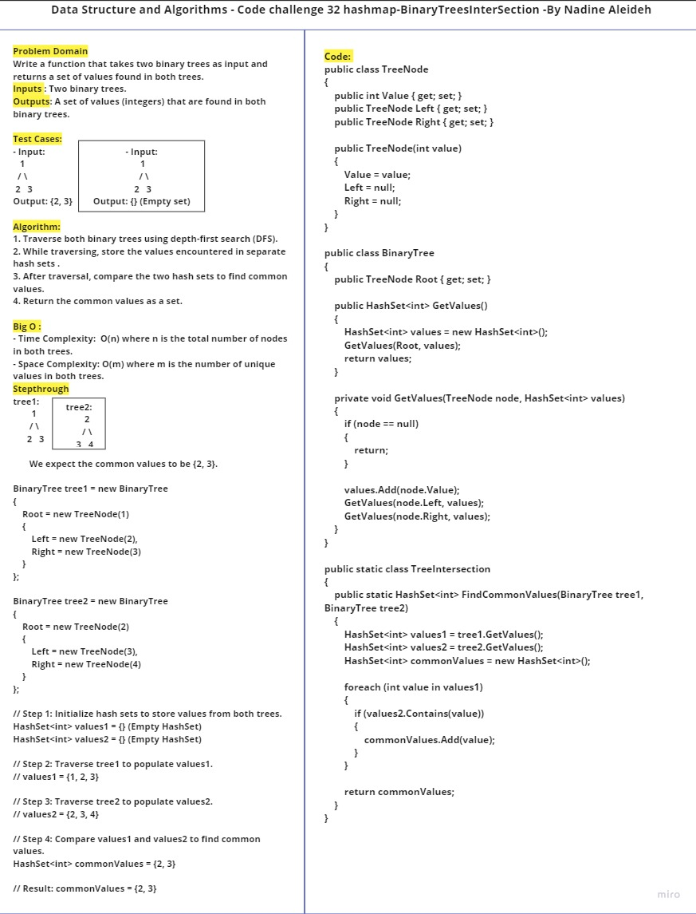
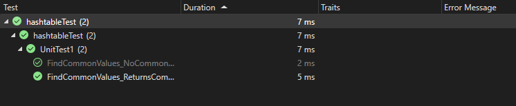

# Challenge 32
Tree Intersection Hashmap implementation as a part of algorithm.

## Whiteboard Process


## Approach & Efficiency
The challenge involves finding common values in two binary trees. Here's the approach:
1. Traverse both binary trees (`tree1` and `tree2`) using depth-first search (DFS) and store encountered values in separate hash sets (`values1` and `values2`).
2. Compare the two hash sets to find common values.
3. Return the common values as a set.

**Time Complexity**: O(N), where N is the total number of nodes in both trees.
**Space Complexity**: O(M), where M is the number of unique values in both trees.

## Code
```

public class TreeNode
{
    public int Value { get; set; }
    public TreeNode Left { get; set; }
    public TreeNode Right { get; set; }

    public TreeNode(int value)
    {
        Value = value;
        Left = null;
        Right = null;
    }
}

public class BinaryTree
{
    public TreeNode Root { get; set; }

    public HashSet<int> GetValues()
    {
        HashSet<int> values = new HashSet<int>();
        GetValues(Root, values);
        return values;
    }

    private void GetValues(TreeNode node, HashSet<int> values)
    {
        if (node == null)
        {
            return;
        }

        values.Add(node.Value);
        GetValues(node.Left, values);
        GetValues(node.Right, values);
    }
}

public static class TreeIntersection
{
    public static HashSet<int> FindCommonValues(BinaryTree tree1, BinaryTree tree2)
    {
        HashSet<int> values1 = tree1.GetValues();
        HashSet<int> values2 = tree2.GetValues();
        HashSet<int> commonValues = new HashSet<int>();

        foreach (int value in values1)
        {
            if (values2.Contains(value))
            {
                commonValues.Add(value);
            }
        }

        return commonValues;
    }
}
```

## Solution

To use the `FindCommonValues` function:
1. Include the provided code for `TreeNode`, `BinaryTree`, and `TreeIntersection` in your C# project.
2. Create two binary trees (`tree1` and `tree2`) with nodes and values.
3. Call the `FindCommonValues` method with `tree1` and `tree2` as parameters.
4. Iterate through the result set to access the common values found in both trees.

### Example

```
BinaryTree tree1 = new BinaryTree
{
    Root = new TreeNode(1)
    {
        Left = new TreeNode(2),
        Right = new TreeNode(3)
    }
};

BinaryTree tree2 = new BinaryTree
{
    Root = new TreeNode(2)
    {
        Left = new TreeNode(3),
        Right = new TreeNode(4)
    }
};

HashSet<int> commonValues = TreeIntersection.FindCommonValues(tree1, tree2);

foreach (int value in commonValues)
{
    Console.WriteLine("Common Value: " + value);
}
```

This example will output:

```
Common Value: 2
Common Value: 3
```


## Test 


