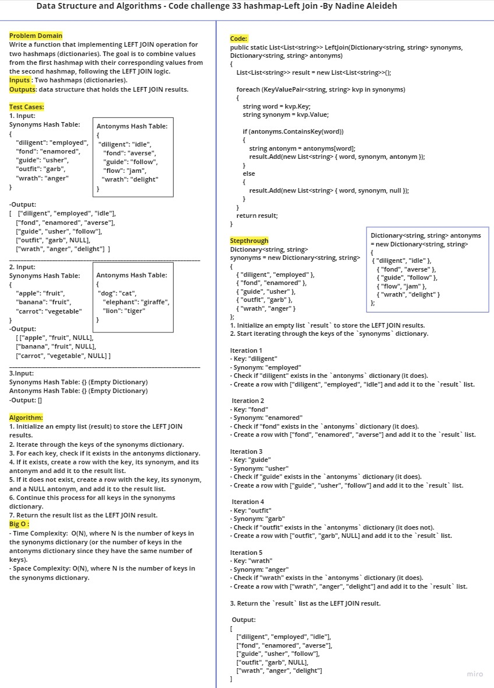
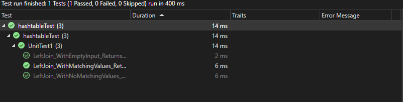

# Challenge 33

Implementation of LEFT JOIN operation for two hashmaps (dictionaries) in C#. The goal is to combine values from the first hashmap with their corresponding values from the second hashmap, following the LEFT JOIN logic.
## Whiteboard Process


## Approach & Efficiency
- Approach: We iterate through the keys of the synonyms dictionary and check if each key exists in the antonyms dictionary. If it exists, we create a row with the word, its synonym, and its antonym; if it does not exist, we create a row with a NULL antonym. We repeat this process for all keys in the synonyms dictionary.

- Time Complexity: O(N), where N is the number of keys in the synonyms dictionary (or the number of keys in the antonyms dictionary since they have the same number of keys).

- Space Complexity: O(N), where N is the number of keys in the synonyms dictionary.

## Code
```

public static List<List<string>> LeftJoin(Dictionary<string, string> synonyms, Dictionary<string, string> antonyms)
    {
      List<List<string>> result = new List<List<string>>();

      foreach (KeyValuePair<string, string> kvp in synonyms)
      {
        string word = kvp.Key;
        string synonym = kvp.Value;

        // Check if the word has an antonym in the antonyms dictionary
        if (antonyms.ContainsKey(word))
        {
          string antonym = antonyms[word];
          result.Add(new List<string> { word, synonym, antonym });
        }
        else
        {
          // If no antonym exists, add a null value
          result.Add(new List<string> { word, synonym, null });
        }
      }

      return result;
    }
```

## Solution

To use the LeftJoin function:

1. Include the provided code for the `LeftJoin` function in your C# project.
2. Create two dictionaries (`synonyms` and `antonyms`) with word strings as keys and corresponding synonym and antonym strings as values.
3. Call the `LeftJoin` method with `synonyms` and `antonyms` as parameters.
4. Iterate through the result data structure to access the left join results, which contain the word, synonym, and antonym values (or NULL if no antonym exists).

### Example

```
Dictionary<string, string> synonyms = new Dictionary<string, string>
{
    { "diligent", "employed" },
    { "fond", "enamored" },
    { "guide", "usher" },
    { "outfit", "garb" },
    { "wrath", "anger" }
};

Dictionary<string, string> antonyms = new Dictionary<string, string>
{
    { "diligent", "idle" },
    { "fond", "averse" },
    { "guide", "follow" },
    { "flow", "jam" },
    { "wrath", "delight" }
};

List<List<string>> leftJoinResult = LeftJoin(synonyms, antonyms);

foreach (List<string> row in leftJoinResult)
{
    Console.WriteLine("[" + string.Join(", ", row) + "]");
}

```

This example will output:

```
["diligent", "employed", "idle"]
["fond", "enamored", "averse"]
["guide", "usher", "follow"]
["outfit", "garb", NULL]
["wrath", "anger", "delight"]

```


## Test 


