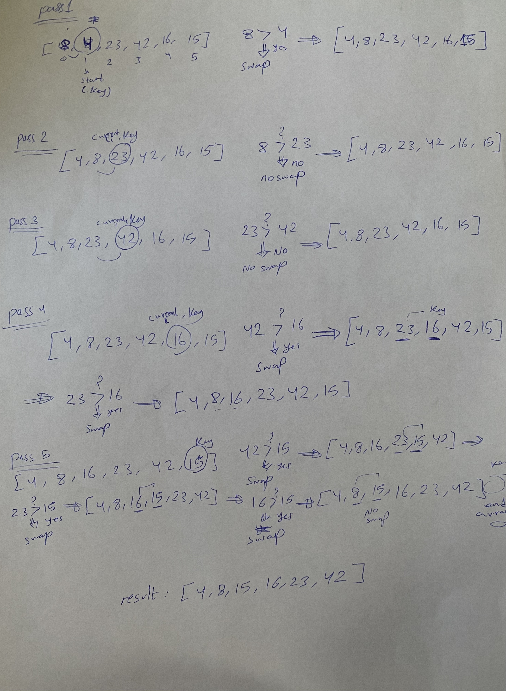
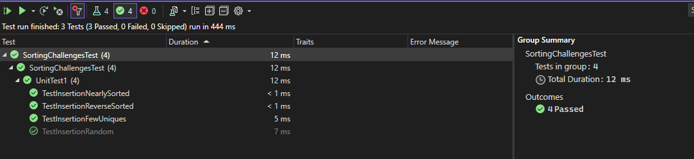

# Blog Notes: Insertion Sort

Insertion Sort is a simple sorting algorithm that builds the final sorted array one item at a time. It works by iteratively considering each element in the input array and inserting it into its correct position within the sorted portion of the array.

## Code

```
    static public int[] InsertionSort(int[] arr)
    {
      int key, j;
      int n = arr.Length;

      for (int i = 1; i < n; i++)
      {
        key = arr[i];
        j = i - 1;

        while (j >= 0 && arr[j] > key)
        {
          arr[j + 1] = arr[j];
          j--;
        }

        arr[j + 1] = key;
      }

      return arr;
    }

```

## Trace

Sample Array: [8,4,23,42,16,15]


### Pass 1 of Insertion Sort

In the first pass through of the insertion sort, the value 4 is selected as the current element to be inserted into the sorted subarray. The algorithm then compares it with the element before it (8) and performs a swap. This results in the updated subarray [4, 8, 23, 42, 16, 15].


### Pass 2 of Insertion Sort

During the second pass, the value 23 is selected and compared with the elements before it. It is found to be larger than 8 and 4, so no swaps occur, leaving the subarray unchanged: [4, 8, 23, 42, 16, 15].


### Pass 3 of Insertion Sort

In the third pass, the value 42 is considered. It's greater than the preceding elements, so it remains in its position. The subarray remains [4, 8, 23, 42, 16, 15].


### Pass 4 of Insertion Sort

During the fourth pass, the value 16 is selected. It's smaller than 42, so a swap occurs between 42 and 16, resulting in the subarray [4, 8, 23, 16, 42, 15]. Next, the value 16 is also compared with 23, leading to another swap and yielding [4, 8, 16, 23, 42, 15].


### Pass 5 of Insertion Sort

The fifth pass involves the value 15. It is smaller than 42, so 42 moves one position to the right. Similarly, 23 is also shifted, and 16 ends up in its correct position. This leads to the final subarray [4, 8, 15, 16, 23, 42].



### Efficiency

- Time: O(n^2)

Insertion sort compares each element with the elements before it in the sorted portion of the array. In the worst case, for each element, it needs to traverse the entire sorted portion. This results in a time complexity of O(n^2).

- Space: O(1)

Insertion sort operates in-place, only requiring a constant amount of additional space regardless of the input size. Hence, its space complexity is O(1).


### Test Results


