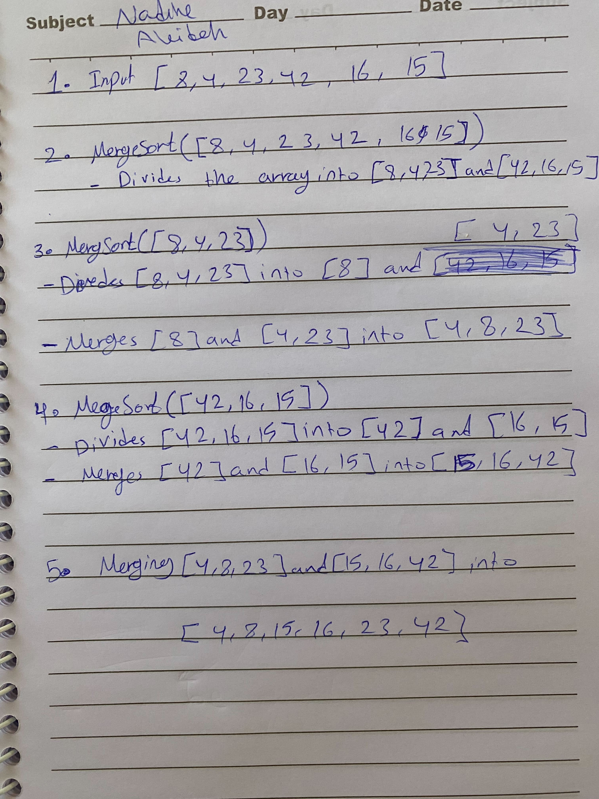
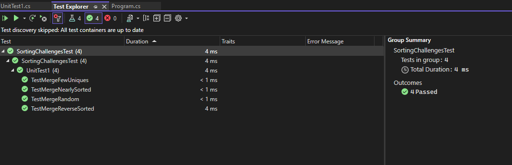

# Blog Notes: Merge Sort

Merge Sort is a divide-and-conquer sorting algorithm that recursively divides the input array into smaller subarrays until each subarray contains a single element. Then, it merges these sorted subarrays back together to produce the final sorted array.

## Code

```
 public static int[] MergeSort(int[] arr)
    {
      int n = arr.Length;

      if (n > 1)
      {
        int mid = n / 2;
        int[] left = new int[mid];
        int[] right = new int[n - mid];

        for (int i = 0; i < n; i++)
        {
          if (i < mid)
          {
            left[i] = arr[i];
          }
          else
          {
            right[i - mid] = arr[i];
          }
        }

        MergeSort(left);
        MergeSort(right);
        Merge(left, right, arr);
      }

      return arr;
    }


    static void Merge(int[] left, int[] right, int[] arr)
    {
      int i = 0;
      int j = 0;
      int k = 0;

      while (i < left.Length && j < right.Length)
      {
        if (left[i] <= right[j])
        {
          arr[k] = left[i];
          i++;
        }
        else
        {
          arr[k] = right[j];
          j++;
        }
        k++;
      }

      if (i == left.Length)
      {
        while (j < right.Length)
        {
          arr[k] = right[j];
          j++;
          k++;
        }
      }
      else
      {
        while (i < left.Length)
        {
          arr[k] = left[i];
          i++;
          k++;
        }

      }
    }

```
## Trace

Sample Array: [8,4,23,42,16,15]. 

In the first pass of the merge sort, the array is divided into two subarrays: [8, 4, 23] and [42, 16, 15]. Each subarray is further divided until individual elements are reached.

During the second pass, the [8, 4, 23] subarray is sorted and merged back. Then, the [42, 16, 15] subarray is sorted and merged. Finally, the two sorted subarrays are merged to produce the sorted subarray [4, 8, 15, 16, 23, 42].




### Efficiency

- Time: O(n log n)

Merge Sort divides the array into smaller halves until each subarray contains a single element, requiring log n divisions. Then, merging the subarrays together takes linear time. The total time complexity is O(n log n).

- Space: O(n)

Merge Sort requires additional space to store the divided subarrays during the merge step. The space complexity is O(n) due to the auxiliary space required for merging.

### Test Results


